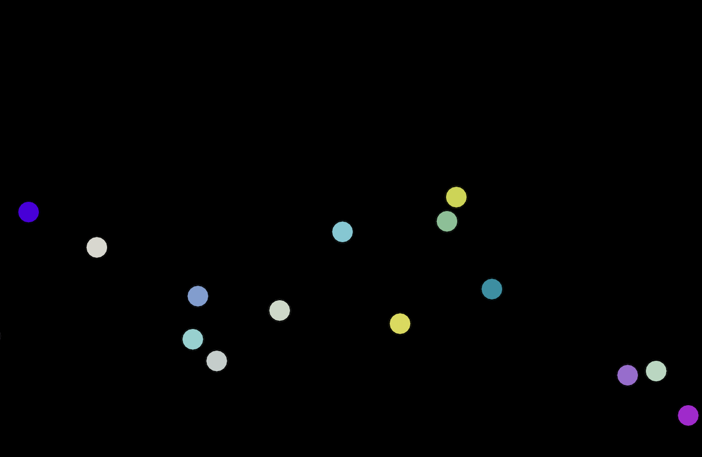

# Bouncing Balls



Click on a canvas to spawn a ball with a random color and velocity.  
The balls are affected by various forces and can bounce off the walls.

## Quick Start

Assuming you have Node.js installed, you can run the following commands to start the app:

```bash
npm install
npm run dev
```

Then open [http://localhost:3000](http://localhost:3000) in your browser.

Node version is specified in `.nvmrc` file and can be installed using [nvm](https://github.com/nvm-sh/nvm])

```bash
nvm install
```

## Libraries used:

-   Next.js - React framework
-   Tailwind CSS - Styling
-   React-three/fiber - 3D Rendering
-   React-three/drei - few helper components for react-three/fiber
-   React-three/test-renderer - allow testing react-three/fiber components
-   Zustand - global state management
-   Playwright - E2E testing
-   Vitest - Unit testing
